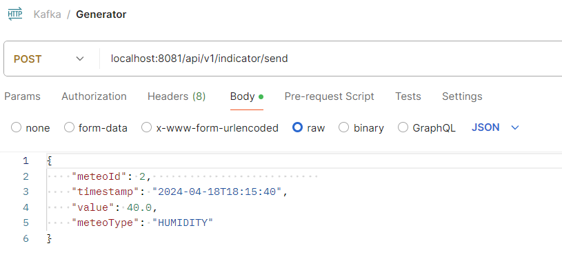

# Generator microservice

### <u>Run guide:</u>

#### To build the project:

* .\mvnw clean package
* if not yet...then create\
  docker network create kafka_net --driver bridge

#### To execute the app:

This part needs to be run after the Server

* *docker-compose up -d*

The Generator is running on port 8081 and has two endpoints:

* POST /api/v1/indicatorEntity/send\
  Example JSON

```
  {
      "meteoId": 2,                           
      "timestamp": "2024-04-18T18:15:40",
      "value": 40.0,
      "meteoType": "HUMIDITY"
  }  
```

* POST /api/v1/indicatorEntity/test/send\
  This endpoint simulates the operation of weather sensors and transmits data the Generator with a specified frequency\
  Example JSON

```
  {
      "delayInMilliseconds": 200,
      "count": 100,
      "meteoTypes": ["PRESSURE","TEMPERATURE","HUMIDITY"]
  }  
```

#### Example file <u>.env</u>:

KAFKA_BOOTSTRAP_SERVERS=broker-1:9090,broker-2:9090

<details>
<summary>Application view</summary>



</details>