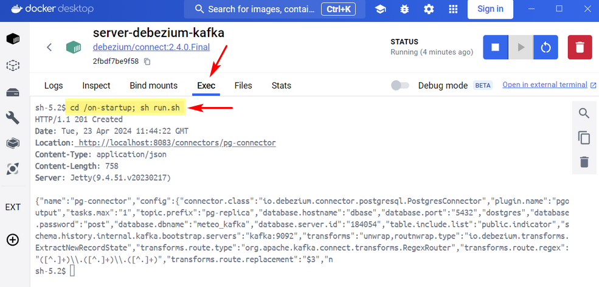

# Server microservice

### <u>Run guide:</u>

#### To build the project:

* .\mvnw clean package
* if not yet...then create \
  docker network create kafka_net --driver bridge

#### To execute the app:

* *docker-compose up -d*
* start Postgres connector for <u>server-debezium-kafka</u> conteiner with command:
```
  cd /on-startup; sh run.sh
```


The Server is running on port 8082

#### Example file <u>.env</u>:

KAFKA_BOOTSTRAP_SERVERS=broker-1:9090,broker-2:9090 \
KAFKA_SUBSCRIBED_TOPICS=indicatorEntity-temperature,indicatorEntity-humidity,indicatorEntity-pressure \
KAFKA_GROUP_ID=indicatorEntity-create-events

DEBEZIUM_GROUP_ID=1

POSTGRES_HOST=dbase:5432 \
POSTGRES_DB=meteo_kafka \
POSTGRES_USER=postgres \
POSTGRES_PASSWORD=post