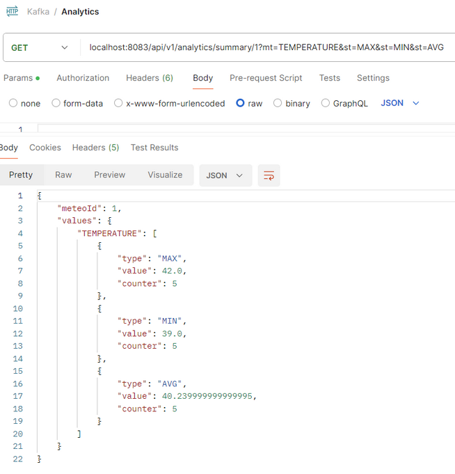
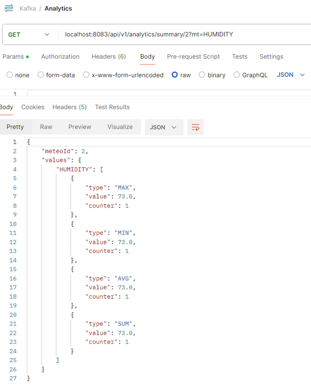

# Store microservice

### <u>Run guide:</u>

#### To build the project:

* .\mvnw clean package
* if not yet...then create\
  docker network create grpc_net --driver bridge

#### To execute the app:

This part needs to be run after the Server

* *docker-compose up -d*

The Store is running on port 8083 and has one endpoint:
* GET /api/v1/analytics/summary/{meteoId}\

with parameters:
* <u>mt</u> (TEMPERATURE, HUMIDITY, PRESSURE) 
* <u>st</u> (MIN, MAX, AVG, SUM)

#### Example file <u>.env</u>:
REDIS_HOST=redis \
REDIS_PORT=6379 

KAFKA_BOOTSTRAP_SERVERS=broker-1:9090,broker-2:9090 \
KAFKA_GROUP_ID=indicatorEntity-summary-events

Application view

---

